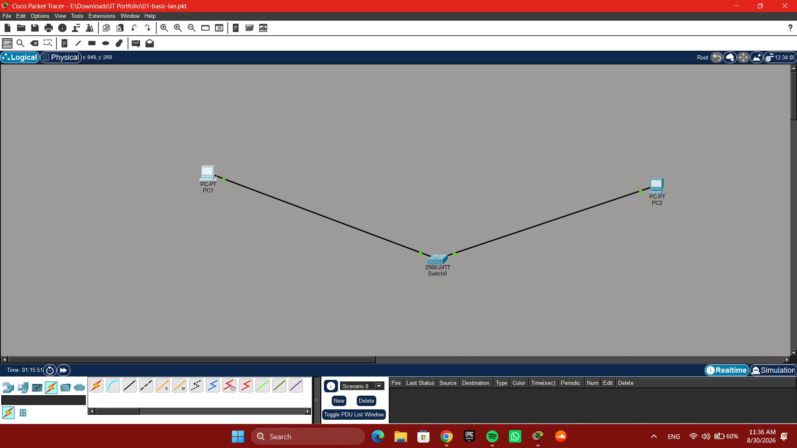

# 01 - Basic LAN Configuration

## Objective

Configure a simple Local Area Network using two PCs connected through a Layer 2 Cisco 2960 switch and verify connectivity between the devices.

## Network Topology

The network consists of two PCs connected to a Cisco 2960 switch.



## IP Address Configuration

| Device | IPv4 Address | Subnet Mask   |
| ------ | ------------ | ------------- |
| PC1    | 192.168.1.10 | 255.255.255.0 |
| PC2    | 192.168.1.11 | 255.255.255.0 |

Both PCs are configured on the same IPv4 subnet. No default gateway is required because communication takes place within the local network.

### PC1 Configuration


## Connectivity Test

Connectivity was tested from PC1 using ICMP:

```text
ping 192.168.1.11
```

The test returned successful replies, confirming communication between PC1 and PC2.


## Devices and Tools

* 2 × PCs
* 1 × Cisco 2960 switch
* Ethernet connections
* Cisco Packet Tracer

## Skills Practiced

* IPv4 addressing
* Subnet masks
* LAN configuration
* Ethernet connectivity
* Layer 2 switching
* ICMP ping testing
* Basic network troubleshooting
* Cisco Packet Tracer

## Project File

The Cisco Packet Tracer project is included in this repository:

[Download the Packet Tracer project](01-basic-lan.pkt)

## Project Status

**Completed**

This is a personal networking practice project created to develop practical networking and IT support skills.
