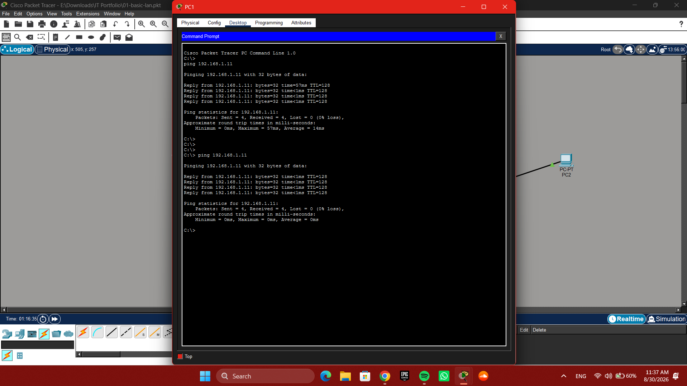

# 01 - Basic LAN Configuration

## Objective

Configure a simple Local Area Network using two PCs connected through a Layer 2 Cisco 2960 switch and verify connectivity between the devices.

## Network Topology

The network consists of two PCs connected to a Cisco 2960 switch.

## IP Configuration and Connectivity Test

PC1 was configured with the IPv4 address `192.168.1.10` and subnet mask `255.255.255.0`. Connectivity was then tested from PC1 by sending ICMP requests to PC2 at `192.168.1.11`.

The successful ping responses confirm that PC1 and PC2 can communicate across the local network.

## Devices and Tools

* 2 × PCs
* 1 × Cisco 2960 switch
* Ethernet connections
* Cisco Packet Tracer

## Skills Practiced

* IPv4 addressing
* Subnet masks
* LAN configuration
* Ethernet connectivity
* Layer 2 switching
* ICMP ping testing
* Basic network troubleshooting
* Cisco Packet Tracer

## Project File

The Cisco Packet Tracer project is included in this repository:

[Download the Packet Tracer project](01-basic-lan.pkt)

## Project Status

**Completed**

This is a personal networking practice project created to develop practical networking and IT support skills.
